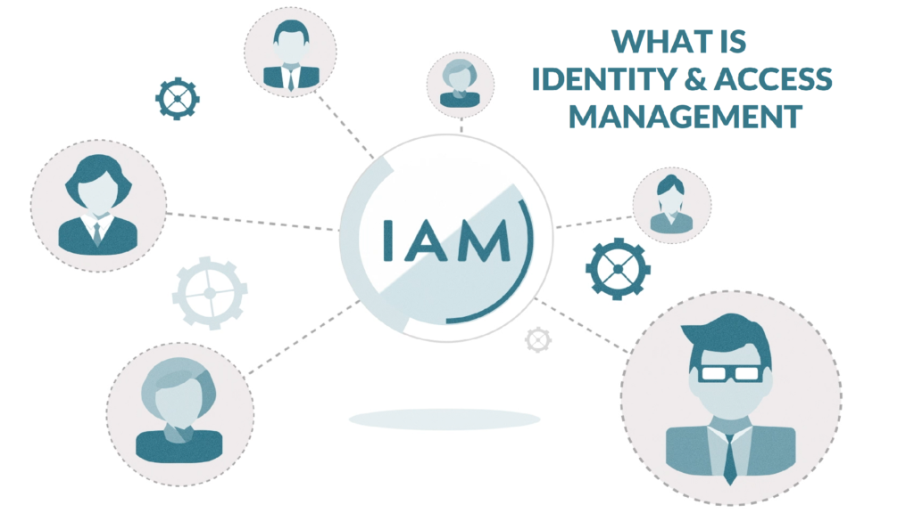

# IAM

## Why do you need a IAM solution

When writing any software applications that stores user data, you need to have a way to manage users and their permissions.
Idealy you do not want to implement this yourself. You as a developer want to focus on writing features for your application.
Thankfully there are many solutions out there that can handle the Identity and Access Management (IAM) for you.

There are proprietary solutions like [IBM IAM](https://www.ibm.com/products/verify-identity/workforce-iam) or [Okta](https://www.okta.com/) but also open source solutions like [Keycloak](https://www.keycloak.org/) or [OpenIAM](https://www.openiam.com/)

For us the most important thing is that we can use a solution that is open source, has an active community, has a good documentation and is easy to use.

## How i made a selection

For the client it was importand to had a self hosted solution, that could run on his own infrastructure.
The client was already ISO27001 complient so we could use that and his active datacenter to host the Keycloak application.

We did not want any tight integration with any other system so we did not want to use any of the proprietary solutions.

We also wanted a solution that had a intuitive admin UI and an extensible client UI so we could modify it to our needs.

That led us to [Keycloak](https://www.keycloak.org/)

## What is keycloak

I believe their homepage says it best.

```
Open Source Identity and Access Management
Add authentication to applications and secure services with minimum effort.
No need to deal with storing users or authenticating users.
Keycloak provides user federation, strong authentication, user management, fine-grained authorization, and more.
```

## How we implemented keycloak into our application